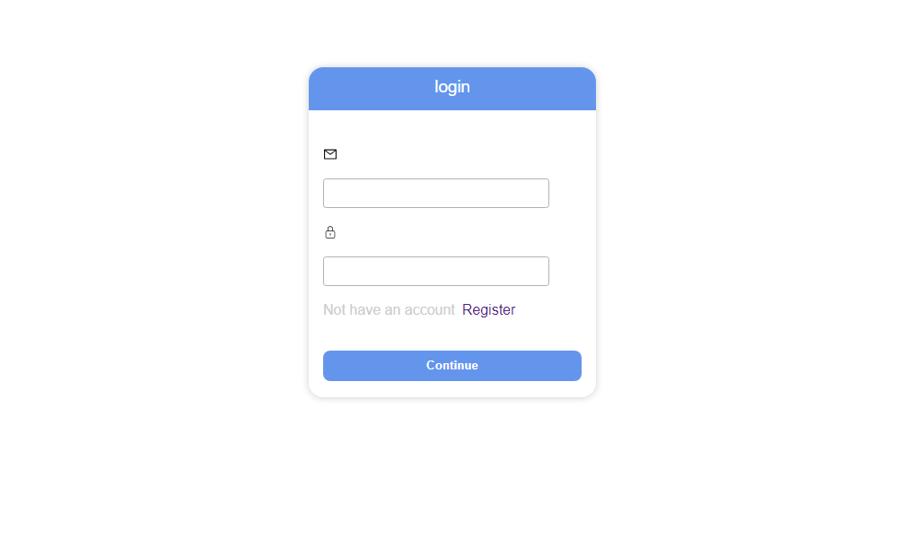
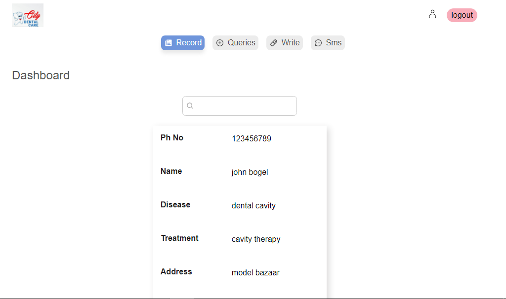
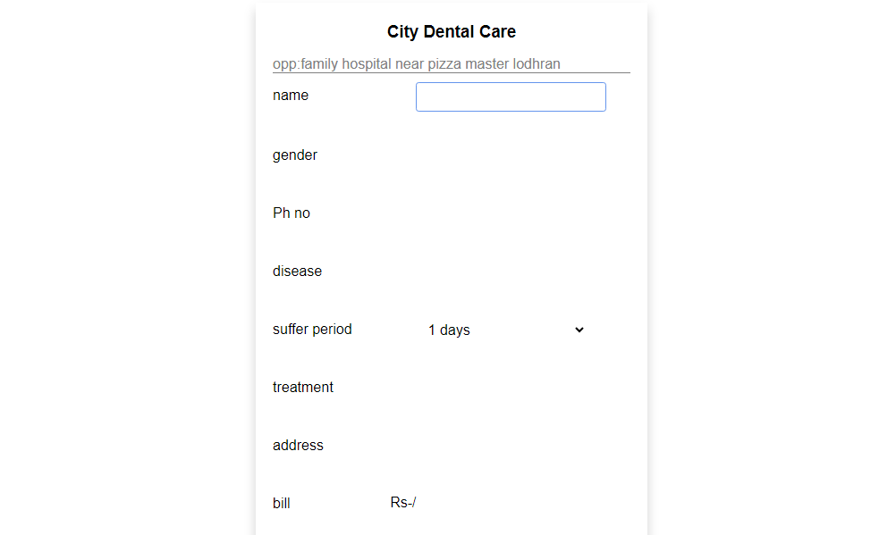

# Dental patient management application

check [http://citydentalcare.netlify.app](http://citydentalcare.netlify.app)

## login credentials

email = umer@dentist.com

password = dentist

## Contribute only if you can addons any value
